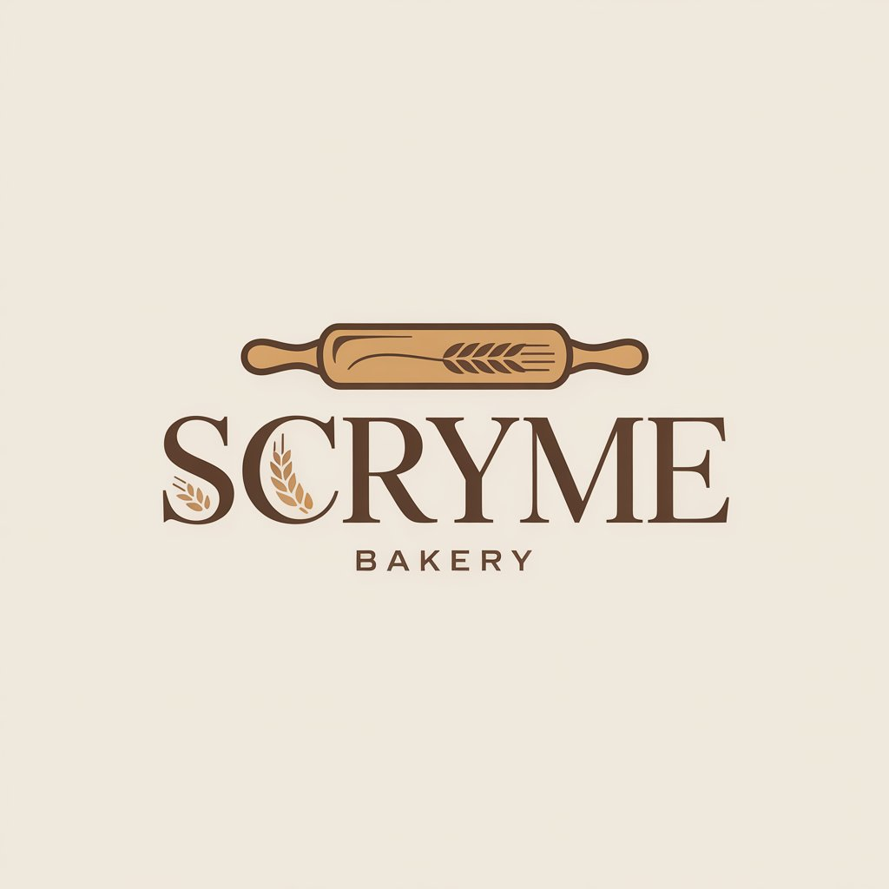

<div align="center">

# ⚡ SCRYME Enterprise ERP & Retail Operations Suite

**Next-Generation Multi-Tenant Retail, Bakery Production, Point of Sale & Supply Chain OS**

<p align="center">
  
</p>

[](https://github.com/larrybwosi/scryme/actions)
[](LICENSE)
[](https://nextjs.org/)
[](https://nestjs.com/)
[](https://tauri.app/)
[](https://www.rust-lang.org/)
[](https://www.typescriptlang.org/)
[](https://www.prisma.io/)
[](https://www.docker.com/)

</div>

---

## 🏛️ Executive Overview

**Scryme** is a high-performance, enterprise-grade Enterprise Resource Planning (ERP) platform architected for modern retail chains, commercial bakeries, supermarkets, pharmacies, and multi-location enterprises. It combines cloud-native management, real-time sync engines, and offline-first desktop terminals into a unified, modular monorepo.

---

## 🚀 Ecosystem Architecture

Scryme is structured as a high-efficiency monorepo managed via [Turborepo](https://turbo.build/) and [pnpm](https://pnpm.io/), ensuring type-safety from backend services down to native desktop and mobile terminals.

```
                                  ┌───────────────────────────┐
                                  │   Scryme Cloud / Core API │
                                  │    (NestJS V3 + Prisma)   │
                                  └─────────────┬─────────────┘
                                                │
         ┌─────────────────────────┬────────────┴────────────┬─────────────────────────┐
         ▼                         ▼                         ▼                         ▼
┌─────────────────┐       ┌─────────────────┐       ┌─────────────────┐       ┌─────────────────┐
│  Scryme Web ERP │       │ Scryme CRM Portal│       │ Scryme POS (v2) │       │ Scryme Bakery OS│
│   (Next.js 15)  │       │   (Next.js 15)  │       │ (Tauri + Rust)  │       │ (Tauri + Rust)  │
└─────────────────┘       └─────────────────┘       └─────────────────┘       └─────────────────┘
```

### 🖥️ Applications (`apps/`)

* 🏢 **[Scryme Web](./apps/web)**: Central enterprise back-office management console for purchasing, multi-location stock movements, purchase order receptions, analytics, and staff scheduling.
* ⚡ **[Scryme API](./apps/api)**: Core NestJS RESTful engine processing multi-tenancy, queueing (RabbitMQ), caching (Redis), transaction safety, and WebSockets/Ably events.
* 👥 **[Scryme CRM](./apps/crm)**: Next.js multi-channel CRM for contact management, lead pipeline tracking, deal stages, loyalty, and automated messaging workflows.
* 🛒 **[Scryme POS](./apps/pos)**: High-availability, offline-first Tauri v2 desktop checkout workstation. Includes native thermal printer drivers (ESC/POS), hardware barcode scanners, cash drawers, and second-screen customer displays.
* 🥖 **[Scryme Bakery](./apps/bakery)**: Specialized Tauri v2 production management workstation for commercial bakeries, scaling recipe formulations, batch scheduling, ingredient tracking, and baker shift management.
* 🛍️ **[Scryme Customer Portal](./apps/portal)**: B2B/B2C Next.js self-service customer portal for account tracking, order history, and digital invoices.
* 🌐 **[Scryme Storefront & Site](./apps/site)**: Enterprise web landing page, download directory for native POS binaries, and headlessly-managed CMS catalog.
* ⚙️ **[Scryme Admin Web](./apps/admin)**: Master administrative console for multi-tenant provisioning, subscription billing, system health diagnostics, and binary release sync.
* 📱 **[Scryme Admin Android](./apps/android)**: Native Kotlin + Jetpack Compose mobile dashboard for real-time sales telemetry, attendance monitoring, and petty cash oversight.
* 🤖 **[Scryme MCP Server](./apps/mcp)**: Model Context Protocol server exposing catalog, inventory, and CRM commands securely to LLMs (Claude Desktop, Cursor).
* 📚 **[Scryme API Docs](./apps/docs)**: Light Vite-based OpenAPI 3.0 interactive documentation portal.

---

### 📦 Modular Package Workspace (`packages/`)

* 🗄️ **[`@repo/db`](./packages/db)**: Prisma schema models, PostgreSQL client singletons, and migration tooling.
* 🔑 **[`@repo/auth`](./packages/auth)**: Multi-tenant identity, SSO, and V3 security helpers powered by Better Auth.
* 🛠️ **[`@repo/shared`](./packages/shared)**: Core system utilities, URL sanitizers, multi-channel notifications (Emails, Handlebars, ScrymeChat, Discord, Webhooks), M-Pesa payments, and Socket.IO adapters.
* 🎨 **[`@repo/ui`](./packages/ui)**: Radix UI accessible primitive components styled with Tailwind CSS v4 and custom hardware barcode listeners.
* 📄 **[`@repo/documents`](./packages/documents)**: React-PDF renderers for thermal receipts, formal A4 invoices, stock transfer slips, and financial statements.
* 💬 **[`@repo/chat`](./packages/scryme)**: M2M SDK for workspace provisioning, member onboarding, and channel messaging via ScrymeChat API.
* 📦 **[`@scryme/sdk`](./packages/sdk)**: Auto-generated TypeScript SDK generated directly from NestJS OpenAPI specifications.

---

## 🛠️ Enterprise Tech Stack

| Domain | Technology | Description |
| :--- | :--- | :--- |
| **Monorepo Engine** | [Turborepo](https://turbo.build/) & [pnpm](https://pnpm.io/) | High-speed caching build system and workspace management |
| **Back-Office & Portals** | [Next.js 15](https://nextjs.org/) & [React 19](https://react.dev/) | SSR/SSG server actions with React Server Components |
| **Native Terminals** | [Tauri v2](https://tauri.app/) (Rust + React) | Cross-platform, lightweight, memory-efficient native apps |
| **Backend Engine** | [NestJS](https://nestjs.com/) | Enterprise modular Node.js REST API framework |
| **Mobile Application** | [Kotlin](https://kotlinlang.org/) & Jetpack Compose | Native Android management client |
| **Databases** | [PostgreSQL](https://www.postgresql.org/) & [SQLite](https://sqlite.org/) | Primary cloud relational storage and local desktop SQLite state |
| **ORM & Seeding** | [Prisma ORM](https://prisma.io/) | Type-safe query building and schema migrations |
| **Caching & Messaging** | [Redis](https://redis.io/) & [RabbitMQ](https://www.rabbitmq.com/) | Real-time rate-limiting, job queueing, and pub/sub messaging |
| **Styling** | [Tailwind CSS v4](https://tailwindcss.com/) | Modern utility-first CSS styling engine |

---

## 🔐 Enterprise Guides & Security Architecture

Explore our dedicated deployment and security guides:
* 🔐 **[Customer Single Sign-On & Authentication Guide](./docs/customer-authentication.md)**
* 📦 **[Connected Apps & V3 Catalog Architecture Guide](./docs/v3-connected-apps-catalog.md)**
* 🚀 **[Admin App Deployment & Database Guide](./docs/admin-deployment.md)**
* 🛡️ **[Secure Prisma Studio Containerization Guide](./docs/prisma-studio-deployment.md)**

---

## ⚡ Quick Start for Developers

### Prerequisites

* **Node.js** (v22+) & **pnpm** (`v9+` or `v10+`)
* **Docker** & **Docker Compose**
* **Rust Toolchain** (v1.77+ for building POS & Bakery desktop binaries)
* **Android Studio** & **JDK 21** (for building Android app)

### Development Workflow

1. **Clone Repository**
   ```bash
   git clone https://github.com/larrybwosi/scryme.git
   cd scryme
   ```

2. **Install Workspace Dependencies**
   ```bash
   pnpm install
   ```

3. **Spin Up Infrastructure Containers**
   ```bash
   docker compose up -d
   ```

4. **Environment Setup**
   ```bash
   cp .env.example .env
   cp apps/api/.env.example apps/api/.env
   # Copy additional .env files as required per package
   ```

5. **Database Migration & Seeding**
   ```bash
   pnpm run db:migrate:dev
   pnpm run db:seed
   ```

6. **Launch Monorepo Development Servers**
   ```bash
   pnpm run dev
   ```

---

## 🚢 Production Deployment

### Containerized Web & API Deployment

Deploy production stack using Docker Compose:

```bash
docker compose -f docker-compose.prod.yml up -d
```

### Desktop Binary Compilation (Tauri v2)

To compile release desktop binaries for Scryme POS or Scryme Bakery:

```bash
# Build POS desktop terminal
cd apps/pos
pnpm tauri build

# Build Bakery production terminal
cd ../bakery
pnpm tauri build
```

---

## 📄 License

This repository is licensed under the **GNU Affero General Public License version 3 (AGPL-3.0)**. Refer to the [LICENSE](LICENSE) file for complete details.

<div align="center">
  <sub>Built with precision for enterprise scalability.</sub>
</div>
